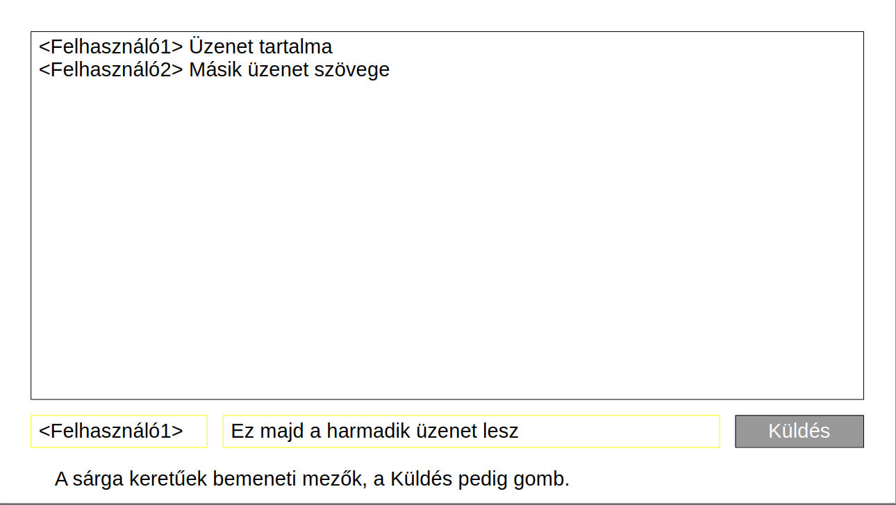
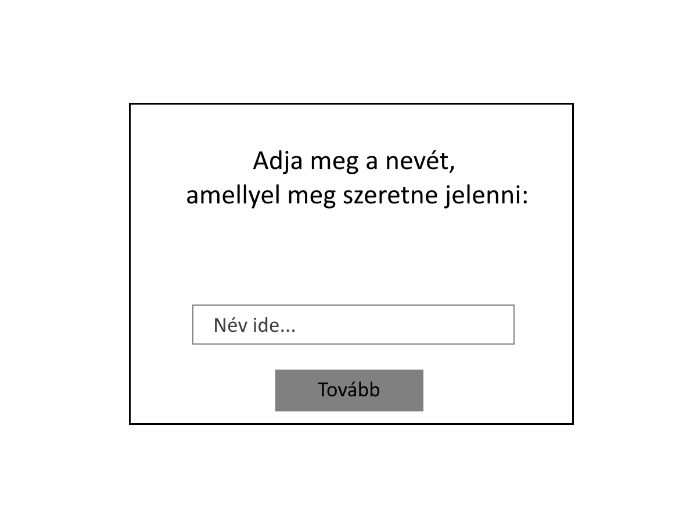

# Funkcionális specifikáció
## 1. Jelenlegi helyzet leírása
Az adott chatfelület alkalmazásra azért van szükség, mert egyszerű és gyors kommunikációs lehetőséget biztosít a felhasználók számára anélkül, hogy regisztrációra vagy bonyolult adatok megadására lenne szükség.
Számos előnnyel jár mint például:
-Azonnali hozzáférés: Csak egy felhasználónévre van szükség, nincs szükség jelszavakra vagy más személyes adat megadására.
-Könnyen használható: Bárki használhatja,nem igényel informatikai tudást.Egyedül internet hozzáférésre van szükség.
-Lehetőség van valós név nélkül kommunikálni: A felhasználók anonim módon is beszélgethetnek, mivel bármilyen felhasználónév megadható.

## 2. Vágyálomrendszer leírása
Megrendelő vágyálma egy olyan letisztult és egyszerű felület, ahol a felhasználók azonnal csatlakozhatnak a beszélgetéshez néhány kattintással, regisztráció és személyes adatok megadása nélkül. A chat valós időben frissüljön a könnyebb kommunikáció érdekében.A weboldal telefonon,tableten és asztali számítógépen is könnyen használható legyen, így reszponzív weboldal fog készülni.A platform biztonságos, átlátható kialakítású legyen, hogy mindenki kényelmesen érezze magát a beszélgetések során.Fő Célja az, hogy baráti csevegés vagy új kapcsolatok jöjjenek létre.

## 3. Jelenlegi üzleti folyamatok modellje
A mostani chat alkalmazások/felületek túlnyomó része sokak számára rengeteg felesleges és bonyolult funkciókkal van ellátva, kevés az olyan szolgáltatás, amellyel ténylegesen egyszerűen lehet üzenetet küldeni online mások számára.

## 4. Igényelt üzleti folyamatok modellje
Az egyszerű és letisztult üzenetküldés céljából hozzuk létre ezt a felületet, hogy megrendelőink számára egy olyan szolgáltatás álljon rendelkezésükre, ahol nem kell a regisztrációra, vagy a bonyolult felépítésre koncentrálni, hanem lényegretörően, effektíven tudjanak kommunikálni egymással.

## 5. Követelménylista

| Id | Modul | Név | Leírás |
| :---: | --- | --- | --- |
| K1 | Felület | Üdvözlő oldal | Felhasználót üdvözli majd Felhasználónevet kér |
| K2 | Felület | Chat room | A felhasználó bekerül egy chatszobába ahol üzeneteket tud küldeni és fogadni |

## 6. Használati esetek
Az oldalra látogatva automatikusan üdvözlő oldal tölt be,ahol kérni fogja,hogy adjuk meg a felhasználónevünket amivel szerepelni szeretnénk a chatszobába.Ezután ha rákattintunk a "tovább" gomba,bekerülünk a chatszobába ahol már többen is lehetnek és kezdődhet a beszélgetés.Jogosultságok csak egyfajta lesz,általános felhasználó jogosultság.

## 7. Megfeleltetés, hogyan fedik le a használati eseteket a követelményeket
A szerver elindítása után a felhasználók tudnak csatlakozni webböngészőjükkel, és használni az alkalmazást a követelmények szerint. A szerver induláskor betölti a mentett üzeneteket, és folyamatosan menti a futás közben beérkezetteket.
A kliens meg tudja adni az üdvözlőoldalon a felhasználónevét, majd utána üzeneteket tud küldeni.

## 8. Képernyőtervek

## 9. Forgatókönyvek
Az oldalra belépve a felhasználó egy felugró ablakban megadhatja a nevét, ahogyan meg szeretne jelenni mindenki más számára. A "tovább" gomb megnyomása után egy ablakban láthatja a mások által küldött üzeneteket, azokat is, amelyeket a belépés előtt küldtek el. Az ablak alatt lévő mezőkben láthatja a saját megadott nevét, valamint a kívánt üzenetet is beírja a másik mezőbe. Ezután a küldés gombra kattintva továbbítja a szerver felé az üzenetet, amely majd a többi felhasználó számára is megjelenik.

## 10. Funkció - követelmény megfeleltetése

| Id | Követelmény | Funkció |
| :---: | --- | --- |
| K1 | Frontend | Név bekérése | Üdvözlő oldal |
| K2 | Frontend | Üzenetek visszaolvasása | Chat room |
| K3 | Frontend | Üzenetküldés | Chat room |
| K4 | Backend | Üzenetmegmaradás | Chat room |

## 11 Fogalomszótár
| Fogalom | Leírás |
| :---: | --- |
| Reszponzív weboldal | A felület mérete és az elemek elhelyezkedése alkalmazkodik a böngésző ablakméretéhez |
